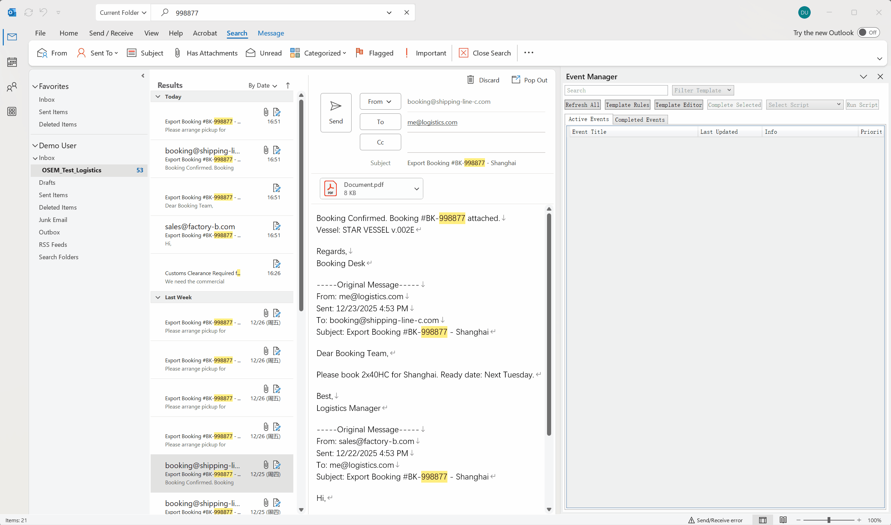
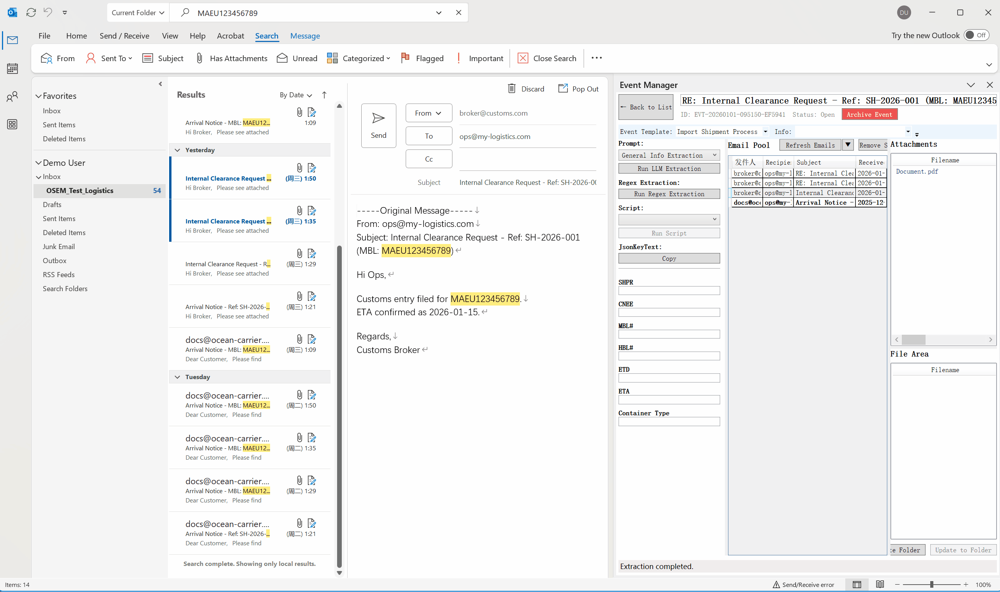

# OSEM: Outlook Smart Event Manager
> **可编程、AI 驱动的 Outlook 事件管理系统。**
> *利用本地 LLM 提取数据并结合 Python 自动化，将您的收件箱转化为结构化的数据中心。*

---

## 简介 (Introduction)

> **你有想过吗？**
>
> 当你看到一封邮件的时候，你点击它，然后它像那些我们最爱的传统 RPG 游戏一样，记录在你的任务追踪目标里。它随时都在那里，自动更新进度。你打开扫一眼，就知道你要做什么，你有你需要的所有的信息和道具去完成这个任务，然后提交。

传统的 Outlook 工作流就像一个 UI/UX 设计非常烂的游戏。你到这里，获取了一个道具，它进入了你的背包里。除非有另一个 NPC 和你对话，或者你像最早的那些硬核玩家一样，拿起攻略本，又或者手写小纸条，不然它就这么丢失了。

那些在这里交纳五个土豆，那里交纳五个圣代，最后只为了拿一个做完所有支线的成就。你可能会在一片森林里突然看到一个 NPC 向你索要道具，然后你只能传送回城里，然后千里迢迢赶来，拿一份还不够传送费的报酬。

同理，在 Outlook 中，你需要在大脑中缓存零散的邮件、附件和任务状态，并在它们之间不断切换上下文。这种 **基于收件箱 (Inbox-based)** 的模式是反人性的，它在无声无息中增加了你的认知成本——尤其是当你面对十几二十个关键词都一样、只是数字编号不一样的待办事项的时候。一个塞满了档案袋的 ToDoList 就是你最需要的东西。

OSEM 的代码实现并不复杂，它只是做了一件最简单却最重要的事情：**将记忆外包给机器**。

通过将碎片化的邮件重组为结构化的 **“事件 (Events)”**，OSEM 让 Outlook 替你记住“这件事进行到哪了”，而不是让你去翻找“那封邮件在哪”。无论是本地 LLM 的智能提取，还是 Python 脚本的自动化，本质上都是为了一个目的——**把你的大脑从机械的记忆和检索中解放出来，去处理真正需要智慧的决策，或者让你更容易进入心流，高效地处理那些不得不处理的工作，然后将你的精力留给生活。**

---

## 核心功能 (Core Features)

### 1. 极简工作流 (Streamlined Workflow)
*   **拖拽创建:** 只需将一封邮件拖入事件管理器，即可创建一个追踪事件。
*   **上下文感知:** 自动聚合属于同一会话（Conversation Thread）的所有历史邮件。
*   **独立文件区:** 每个事件都映射一个独立的本地文件夹（可配置仓库路径），支持将桌面文件与邮件附件统一管理。
*   **智能导出:** 支持导出进行中和已归档的事件。内置模板文件哈希校验机制，仅导出被修改过的模板文件，避免冗余备份。

### 2. Python 脚本接口
使用标准的 Python 脚本扩展 Outlook 的能力。
*   **事件级自动化:** 针对特定事件运行脚本，处理附件、验证数据或生成报告。
*   **系统集成 (ERM Ready):** OSEM 实际上已经具备了 **ERM (Enterprise Resource Management)** 系统的骨骼。你甚至可以编写脚本，从事件中提取关键数据，直接通过 API 或 XML 注入到企业级系统（如 **CargoWise One***、SAP）中，打通“邮件 -> 核心业务系统”的最后一公里。

    > *\* CargoWise One 是 WiseTech Global 的商标。本项目与 WiseTech Global 无关联。*

### 3. 智能提取 (AI & Regex)
*   **本地 LLM 支持:** 深度集成 **Ollama**。直接调用 Llama3 或 DeepSeek 等模型在本地解析邮件内容。
*   **正则表达式:** 对于格式固定的单据，支持使用高效的正则表达式进行精准提取。
*   **数据隐私:** 您的邮件数据完全在本地处理，除非您主动配置，否则绝不会发送至外部云端 API。

---

## 工作流演示 (Workflow in Action)

### 1. 定义：配置模板仪表盘 (Define: Configure Template Dashboard)
配置您需要追踪的字段，定制专属工作流。

### 2. 捕获：拖拽创建 (Capture)
只需将邮件拖入 OSEM，即可初始化一个事件，并自动聚合相关会话。通过将其他对话的邮件拖入，用一个事件追踪复数的对话。

### 3. 提取：AI 驱动 (Extract)
点击 "AI Extract" 调用本地 LLM，瞬间自动填充仪表盘字段。

### 4. 导出：智能备份 (Export)
导出事件数据及文件，支持智能哈希校验以节省空间。

---

## 应用场景 (Use Cases)

| 场景 | 传统工作流 | OSEM 工作流 |
| :--- | :--- | :--- |
| **国际物流** | 搜索邮件 -> 翻找 PDF -> 确认 ETA | **仪表盘视图** 直观显示 ETA；附件自动归档。 |
| **销售跟单** | 手动记录客户需求和聊天记录 | **AI 自动总结** 客户需求；自动标记优先级。 |
| **IT 运维** | 复制粘贴错误代码到 Excel | **正则/AI 自动提取** 错误代码；脚本自动录入工单系统。 |

---

## 性能与最佳实践 (Performance & Best Practices)

*   **性能优化:** OSEM 专为高负载设计，拥有智能的主线程避让机制，防止 UI 冻结。
*   **启动缓冲:** 当 Outlook 正在同步大量邮件时（例如周一早晨），建议在启动后预留 1-2 分钟的初始化时间，待数据同步完成后再进行批量的重型操作。
*   **响应速度:** 请注意，Outlook 的响应速度可能会比平时略有下降，具体程度取决于您的硬件规格和内存情况。

---

## 快速开始 (Getting Started)

### 前置要求
*   Windows 10/11
*   Outlook Desktop
*   .NET Framework 4.8+
*   (可选) [Ollama](https://ollama.com/) 用于 AI 功能
*   (可选) Python 3.x 用于脚本功能

### 安装步骤

#### 方式一：普通用户 (安装包)
1.  前往 **Releases** 页面下载最新版本的安装包。
2.  解压文件，运行 `setup.exe` 完成安装。
3.  启动 Outlook，在功能区点击 **"Event Manager"** 即可开始使用。

#### 方式二：开发者 (源码构建)
1.  克隆本仓库到本地。
2.  使用 Visual Studio 2022 打开 `OSEMAddIn.sln` (需安装 "Office/SharePoint 开发" 工作负载)。
3.  生成解决方案 (Ctrl+Shift+B)。
4.  按 **F5** 直接运行并在 Outlook 中调试。

### 卸载 (Uninstallation)
1.  打开 Windows **设置** > **应用** > **安装的应用**。
2.  搜索 "OSEM"。
3.  点击右侧的三个点菜单，选择 **卸载**。

> 💡 **详细文档：** 完整的安装、配置与使用指南，请参阅 [用户手册 (User Guide)](Docs/UserGuide_CN.md)。
> 
> 🐍 **脚本开发：** 如果您想编写 Python 脚本扩展功能，请参阅 [脚本接口文档](Docs/ScriptingInterface.md)。

---

## 贡献 (Contributing)
OSEM 基于 C# (VSTO) 和 WPF 构建。我们欢迎提交 Pull Requests 来改进核心逻辑或贡献新的脚本示例。

> **特别说明：**
> 虽然本项目代码由 AI 生成，但**基本功能均经过人类开发者的严格审查与实战检验**，以确保在生产环境下的可靠性。

---

## 支持 (Support)
如果你觉得 OSEM 确实帮到了你，让你有时间去打完那个一直没通关的游戏，或者只是单纯觉得这本“游击士手册”好用，欢迎请我喝杯咖啡。

<!-- 
请将下方的链接替换为您自己的赞助主页链接：
1. Ko-fi: https://ko-fi.com/elysionlhant
2. 爱发电: https://afdian.com/a/elysionlhant
-->

  <!-- Ko-fi (适合海外用户/PayPal) -->
  
  
  <!-- 爱发电 (适合国内用户/微信支付宝) -->
  

---

> "希望节约下的认知成本能让用户回到家看几页想看的书，能有一些注意力留给对自己真正重要的人，能写几行自己本来想写的东西，能发发呆而不是被短视频收割注意力、能不在最脆弱的时候被某些主张偷走自己的可能性。
>
> 若能如此，那么这就是我要做的事情。"
